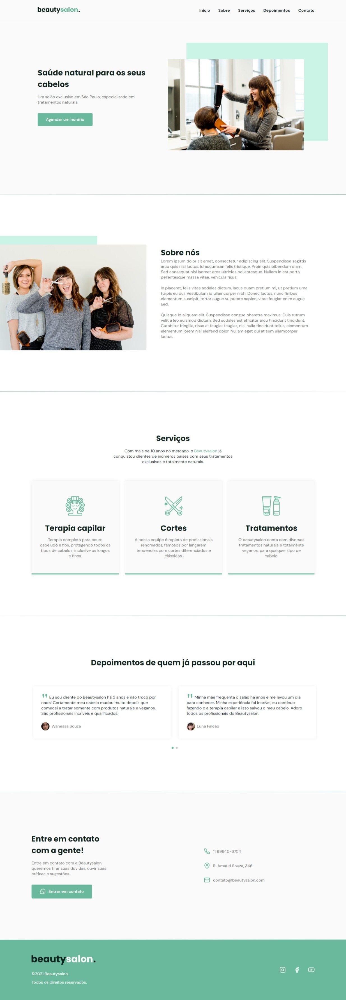

Esta é uma implementação do projeto Origin do NWL together da Rocketseat.

## Conteudos

- [Overview](#overview)
  - [The challenge](#the-challenge)
  - [Screenshot](#screenshot)
  - [Links](#links)
- [My process](#my-process)
  - [Built with](#built-with)
  - [What I learned](#what-i-learned)
  - [Continued development](#continued-development)
  - [Useful resources](#useful-resources)
- [Author](#author)
- [Acknowledgments](#acknowledgments)

## Overview
### The challenge

O desafio era construir uma landing page responsiva de uma salão de beleza, com as funcionalidades de mandar mensagem via WhatsApp e marcar horários na agenda da empresa.

### Screenshot

### Links

- Solution URL: [github](https://github.com/PHnrq/institutional-page)
- Live Site URL: [BeautySalon](https://phnrq.github.io/institutional-page/)

## My process
O desenvolvimento foi inicializado seguindo o layout disponível no Figma, os códigos foram pensados pra ser o mais legível e organizado possíveis, facilitando assim a manutenção futura, meu maior desafio foi manipular o DOM, sendo esse um processo de muita aprendizagem. 
### Built with

- HTML5 Semantico
- CSS3
- Flexbox
- Mobile-first workflow
- JavaScript
- [SwiperJS] (https://swiperjs.com/get-started)

### What I learned

Esse projeto me ajudou a consolidar meu conhecimentos em HTML Semântico ,CSS3 e em Mobile First, também absorvi bastante conhecimento sobre como manipular o DOM

### Continued development

Pretendo aprimorar o funcionamento do menu fazendo com que ele feche ao clicar em uma seção
